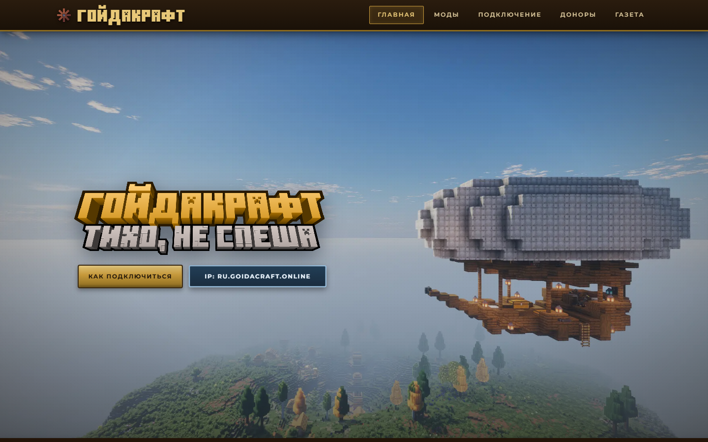
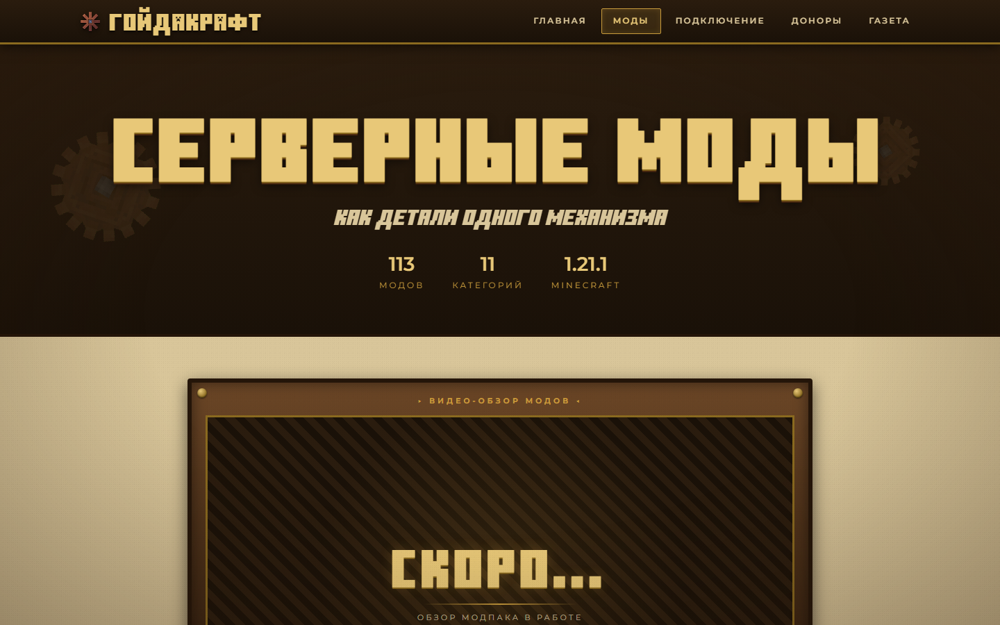
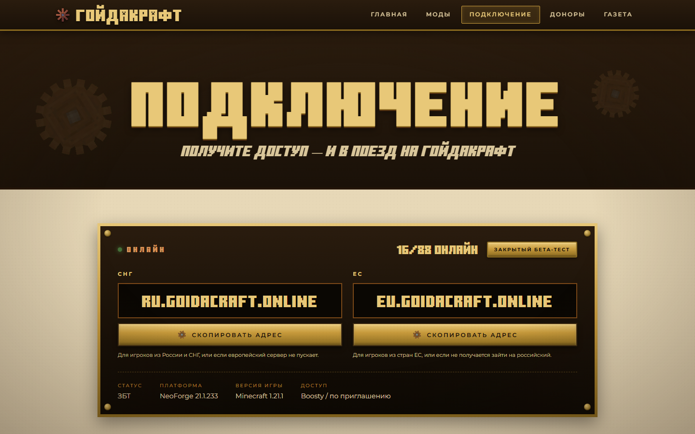
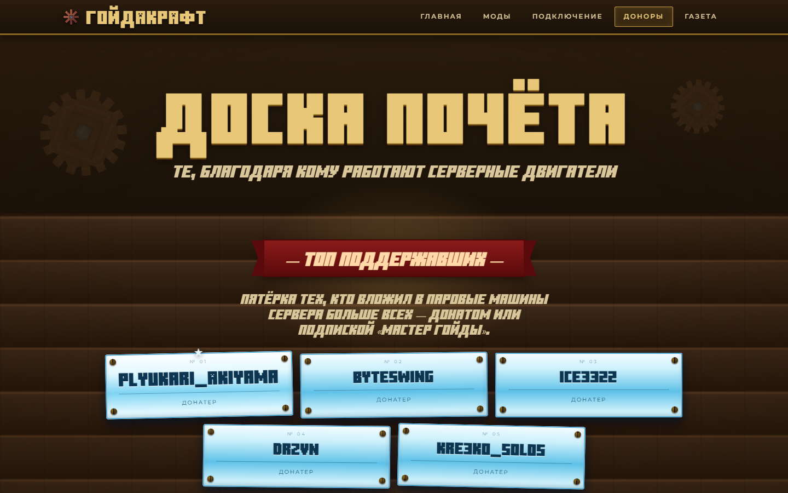
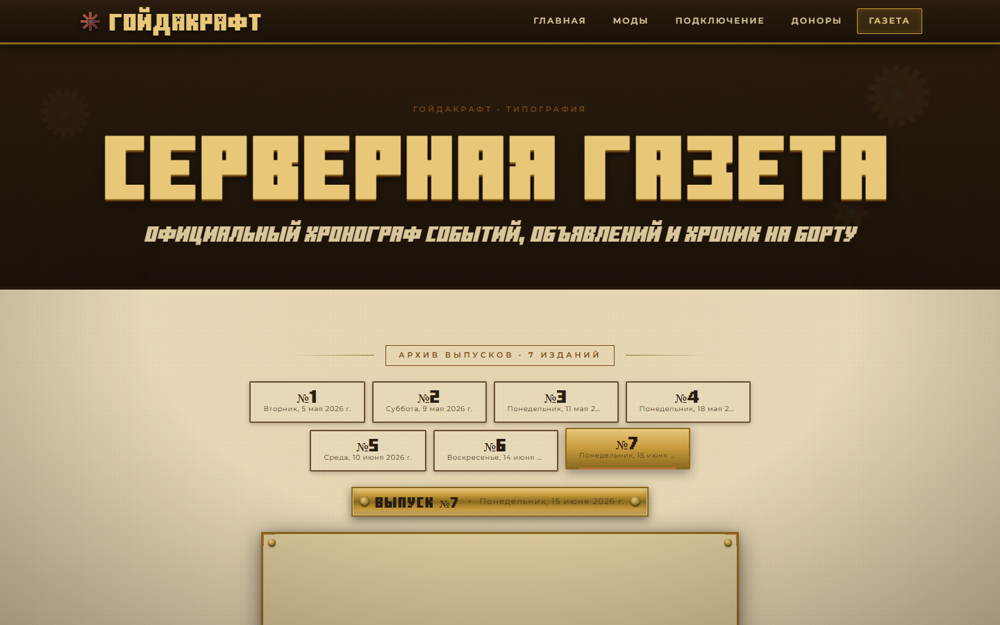

# Гойдакрафт — сайт сервера

Официальный сайт приватного Minecraft-сервера **Гойдакрафт** (**Create: Aeronautics** RP-сервер), собранный на **Next.js** и разворачиваемый как статический экспорт.
Промо-сайт в индустриально-паровой стилистике: подключение к серверу, каталог модов, доска почёта доноров и серверная газета.

- 🌐 Сайт: [goidacraft.online](https://goidacraft.online)
- 🕹️ IP сервера: `ru.goidacraft.online` (СНГ) / `eu.goidacraft.online` (ЕС)
- 💬 Сообщество: [Telegram-канал](https://t.me/goidacraft) · [Telegram-чат](https://t.me/+W-nS71bNZqA4OThi) · [Discord](https://discord.gg/prJwFwy5ns)
- 💸 Поддержать: [Boosty](https://boosty.to/goidacraft)

## Скриншоты

|                                     Главная                                     |                                       Моды                                       |
| :------------------------------------------------------------------------------: | :--------------------------------------------------------------------------------: |
|                           |                              |

|                                   Подключение                                    |                                      Доноры                                       |
| :------------------------------------------------------------------------------: | :--------------------------------------------------------------------------------: |
|                   |                      |

|                                      Газета                                       |
| :--------------------------------------------------------------------------------: |
|                      |

## Технологии

- **Next.js 13.5** (Pages Router)
- **React 18.2**
- **Static export** (`output: 'export'`, `trailingSlash: true`, `images.unoptimized: true`) — без серверного рантайма
- **Node.js >= 14**
- Без CSS-фреймворков — единая ручная дизайн-система в `assets/styles.css`

## Маршруты

| Путь          | Назначение                                                          |
| ------------- | -------------------------------------------------------------------- |
| `/`           | Главная страница: хиро с IP, трейлер, «О проекте», быстрые ссылки |
| `/mods`       | Каталог модов, поиск, категории, сборки и способы установки        |
| `/connect`    | IP, статус сервера, тарифы доступа, ссылки на сообщество, шаги входа |
| `/donors`     | Доска почёта: топ-5, донатеры, «Мастера Гойды»                     |
| `/newspaper`  | Архив серверной газеты (PDF), просмотр и скачивание выпусков        |
| `/console`    | Декоративная псевдо-консоль администратора (пасхалка, доступ через `/mods`) |
| `404`         | Кастомная страница ошибки маршрута                                  |

## Главная (`/`)

- Хиро-секция с логотипом, кнопкой «Как подключиться» и кнопкой копирования IP в буфер обмена.
- Встроенный YouTube-трейлер сервера.
- Блок «О проекте»: философия сервера (взаимоуважение, взаимопомощь, коммуникация) и текущий статус — закрытое бета-тестирование, доступ через Boosty.
- Список модов, на которых держится сборка: **Create & Create: Aeronautics**, **Railways**, **Farmer's Delight**, **Let's Do**, **Enderscape + Rechiseled + Naturalist**.
- Быстрые ссылки-карточки на моды, подключение, доноров и газету.
- Полный SEO-набор: Open Graph, Twitter Card, JSON-LD (`WebSite`, `Organization`, `VideoGame`).

## Моды (`/mods`)

- Полный каталог сборки: **218 модов** в **14 тематических категориях** (ядро Create, аддоны и машины Create, декор Create, Let's Do, кухня Farmer's Delight, хранилища, генерация мира, соц-моды, скриптовая магия, оптимизация, интерфейс, визуал/звук, быт, технические библиотеки).
- Поиск по названию мода и фильтрация по категориям («карта модов» с кликабельными карточками и подробным описанием каждого мода).
- Единая сборка (без вариантов) — оптимизирована и заточена под сервер.
- Два формата установки: ручной **ZIP**-архив и автоматический **.mrpack** (Modrinth/Prism и т.п.).
- Кнопка скачивания сборки (Google Drive).
- Сборка рассчитана на **Minecraft 1.21.1** / **NeoForge 21.1.248**.

## Подключение (`/connect`)

- Два адреса подключения — `ru.goidacraft.online` (СНГ) и `eu.goidacraft.online` (ЕС) — с копированием в буфер и подсказкой, какой сервер выбрать.
- Живой статус сервера (онлайн/офлайн, число игроков) — данные берутся с `api.mcsrvstat.us` по обоим адресам, с кешированием на 5 минут.
- Три тарифа доступа к закрытому бета-тесту через Boosty:
  - **Стандартный** — базовый доступ к тестированию.
  - **1 + 1** — доступ на двоих с равной ответственностью.
  - **Расширенный** — приоритетные тикеты, имя на доске почёта и в ролике на YouTube, именной значок.
- Блок «Приведи друга» для игроков с хорошей репутацией.
- Пошаговая инструкция подключения: доступ → NeoForge → установка модов → запуск → подключение.
- Ссылки на Telegram-чат, Telegram-канал и Discord сообщества.

## Доноры (`/donors`)

- «Топ поддержавших» — пятёрка лидеров по сумме поддержки (донаты + подписка «Мастер Гойды»), выделенная отдельными карточками.
- Общая стена донатеров с ростом визуального ранга при крупных суммах.
- Отдельная стена «Мастеров Гойды» — подписчиков ежемесячного тарифа Boosty.
- Пояснение, куда идут средства (хостинг, домен, развитие сервера) и как попасть на доску почёта.

## Газета (`/newspaper`)

- Архив выпусков серверной газеты в PDF, метаданные и файлы подтягиваются из внешнего репозитория через jsDelivr CDN (`Yukovsky/goidacraft-newspaper`, `manifest.json`).
- Переключение между выпусками карточками-вкладками, стрелками и точками прогресса, а также клавишами `←`/`→`.
- Встроенный просмотр PDF прямо на странице (с фолбэком на «Открыть PDF» для Safari/iOS, где `<iframe>` с PDF не работает).
- Скачивание текущего выпуска одной кнопкой.

## Консоль (`/console`)

Декоративная демонстрационная консоль администратора — не связана с реальным сервером, полностью имитационная (мок-метрики, мок-лог, мок-команды). Открывается только через специальный переход со страницы модов, напрямую по URL недоступна.

## Структура проекта

```text
.
├── pages/                     # Страницы Next.js (Pages Router)
│   ├── _app.js                 # Общий layout, шапка, нижний колонтитул, глобальные эффекты
│   ├── _document.js            # Кастомный документ (шрифты, метатеги уровня документа)
│   ├── index.js                # Главная
│   ├── mods.js                 # Каталог модов
│   ├── connect.js              # Подключение к серверу
│   ├── donors.js                # Доска почёта
│   ├── newspaper.js             # Серверная газета
│   ├── console.js               # Декоративная консоль
│   └── 404.js                   # Страница ошибки маршрута
├── assets/styles.css           # Глобальные стили и дизайн-система (индустриально-паровая тема)
├── public/
│   ├── assets/                 # Скрипты, изображения, курсоры, шрифты
│   │   └── img/readme/         # Скриншоты для этого README
│   └── cache-worker.js          # Service worker для кеширования
├── out/                        # Результат статической сборки (генерируется)
├── next.config.js              # Конфигурация Next.js (static export)
└── package.json                # Скрипты и зависимости
```

## Локальный запуск

```bash
npm install
npm run dev
```

После запуска сайт будет доступен на `http://localhost:3000`.

## Сборка

```bash
npm run build
```

Сборка создаёт статический сайт в папке `out/`.

## Публикация

Проект рассчитан на статическое размещение. После сборки содержимое папки `out/` можно загрузить на любой хостинг статических сайтов.

> В этой конфигурации основной сценарий — именно статическая выдача из `out/`, а не серверный runtime.

## Внешние зависимости

- `https://api.mcsrvstat.us/2/<host>` — статус серверов `ru.goidacraft.online` и `eu.goidacraft.online`
- jsDelivr CDN (`Yukovsky/goidacraft-newspaper`) — `manifest.json` и PDF-выпуски газеты
- YouTube — встроенный трейлер на главной
- Telegram / Discord — ссылки сообщества
- Boosty — донат и доступ к закрытому бета-тесту
- Google Drive — ссылка на скачивание модпака

## Дизайн и поведение

- Единая индустриально-паровая тема оформления: латунь, медь, шестерёнки, заклёпки.
- Кастомные курсоры и декоративные вращающиеся шестерёнки (`gear-host`, `cog`).
- Лоадер на первом входе в сессию.
- Prefetch страниц и ресурсов при наведении на ссылки.
- Service worker (`cache-worker.js`) для кеширования изображений и части данных.
- Полный набор SEO-метатегов на каждой странице: Open Graph, Twitter Card, canonical, JSON-LD.

## Лицензия

Apache License 2.0 — см. [LICENSE](LICENSE).
